# Bug Fix: Multi-School Authentication (v1.0.7)

## Issue Summary

**GitHub Issue**: [#1 - Ich kann mich nicht anmelden](https://github.com/rwunsch/schulmanager-online-hass/issues/1)

**Problem**: Users with multi-school accounts (children at different schools) were unable to authenticate after selecting a specific school. The authentication would fail with a **401 Unauthorized** error.

### User Report

The affected user reported:
- Account has 2 children in different schools
- Initial login detects 2 schools correctly:
  - ID: 358798 - Herzog-Tassilo-Realschule Erding
  - ID: 2509609 - Erzbischöfliche Mädchenrealschule Heilig Blut Erding
- When re-authenticating with a specific institution ID, login fails with 401 error

## Root Cause

The Schulmanager API's `/api/get-salt` endpoint returns **different salts** depending on the `institutionId` parameter passed in the request.

### What Was Happening

```mermaid
sequenceDiagram
    participant Client
    participant API
    
    Note over Client: Step 1: Discovery
    Client->>API: POST /api/get-salt {"institutionId": null}
    API->>Client: Salt A
    Client->>API: POST /api/login with Salt A hash + institutionId=null
    API->>Client: multipleAccounts response
    
    Note over Client: Step 2: Re-auth (BROKEN)
    Note over Client: ❌ Reusing Salt A!
    Client->>API: POST /api/login with Salt A hash + institutionId=358798
    API->>Client: ❌ 401 Unauthorized
```



### What Should Happen


## The Fix

### Changes Made

#### 1. API Client (`custom_components/schulmanager_online/api.py`)

**Modified `_get_salt()` method** to accept and pass through `institution_id`:

```python
# BEFORE (v1.0.6)
async def _get_salt(self) -> str:
    """Get salt for password hashing."""
    payload = {
        "emailOrUsername": self.email,
        "mobileApp": False,
        "institutionId": None  # ❌ Always null!
    }
    # ...

# AFTER (v1.0.7)
async def _get_salt(self, *, institution_id: Optional[int] = None) -> str:
    """Get salt for password hashing. Pass institution_id for multi-school accounts."""
    payload = {
        "emailOrUsername": self.email,
        "mobileApp": False,
        "institutionId": institution_id  # ✅ Passed through!
    }
    # ...
```

**Modified `authenticate()` method** to pass `institution_id` to salt request:

```python
# BEFORE (v1.0.6)
async def authenticate(self, *, institution_id: Optional[int] = None) -> None:
    salt = await self._get_salt()  # ❌ No institution_id
    salted_hash = self._generate_salted_hash(self.password, salt)
    await self._login(salted_hash, institution_id=institution_id)

# AFTER (v1.0.7)
async def authenticate(self, *, institution_id: Optional[int] = None) -> None:
    salt = await self._get_salt(institution_id=institution_id)  # ✅ Passed!
    salted_hash = self._generate_salted_hash(self.password, salt)
    await self._login(salted_hash, institution_id=institution_id)
```

#### 2. Debug Script (`test-scripts/debug_multi_school.py`)

Updated the test script to **refetch salt with institution_id** when re-authenticating:

```python
# When multi-school detected and institution_id specified:
print(f"Step 3b/5: Re-fetching salt with Institution ID {selected_inst_id}...")
salt = get_salt(args.email, institution_id=selected_inst_id)  # ✅ NEW!

print(f"Step 3c/5: Re-computing hash with institution-specific salt...")
hash_hex = pbkdf2_sha512_hex(args.password, salt)  # ✅ NEW!

print(f"Step 3d/5: Re-authenticating with Institution ID {selected_inst_id}...")
data = login(args.email, args.password, hash_hex, institution_id=selected_inst_id)
```

#### 3. Documentation Updates

Updated the following documentation files:
- `Multi_School_Complete_Guide.md`: Added critical bug fix section and updated flow diagrams
- `Authentication_Guide.md`: Added multi-school salt retrieval examples

## Testing Instructions

### For Users with Multi-School Accounts

1. **Update to v1.0.7**:
   ```bash
   cd /home/wunsch/git/schulmanager-online-hass
   git pull
   ```

2. **Test with debug script**:
   ```bash
   python3 test-scripts/debug_multi_school.py \
     --email your@email.com \
     --password 'your_password' \
     --institution-id 358798
   ```

3. **Expected output**:
   ```
   Step 1/5: Fetching salt for password hashing...
            ✓ Salt received (468 characters)

   Step 2/5: Computing PBKDF2-SHA512 hash (99,999 iterations)...
            ✓ Hash computed (1024 characters)

   Step 3/5: Testing login (checking for multiple schools)...
            ⚠️  MULTI-SCHOOL ACCOUNT DETECTED!
            Found 2 schools:
               - ID: 358798  Name: Herzog-Tassilo-Realschule Erding
               - ID: 2509609  Name: Erzbischöfliche Mädchenrealschule Heilig Blut Erding

   Step 3b/5: Re-fetching salt with Institution ID 358798...
            ✓ Institution-specific salt received (468 characters)

   Step 3c/5: Re-computing hash with institution-specific salt...
            ✓ Institution-specific hash computed (1024 characters)

   Step 3d/5: Re-authenticating with Institution ID 358798...
            ✓ Login successful (token: ...abc12345)

   Step 4/6: Analyzing user and student data...
            ✓ Found 1 student(s)
   ```

4. **Set up in Home Assistant**:
   - Remove old integration entry if exists
   - Add integration: Settings → Devices & Services → Add Integration → Schulmanager Online
   - Enter credentials
   - Select school from dropdown (if multi-school)
   - ✅ Should now work!

### Verification

The fix is working correctly if:
- ✅ No 401 error after selecting a school
- ✅ JWT token is received
- ✅ Student data is loaded
- ✅ Sensors appear in Home Assistant

## Impact

### Who Is Affected?

- **Affected**: Users with multi-school accounts (children at different schools)
- **Not Affected**: Users with single-school accounts (worked fine in v1.0.6)

### Backward Compatibility

✅ **Fully backward compatible**

- Single-school accounts: No behavior change (`institution_id=None` works as before)
- Multi-school accounts: Now works correctly (was broken before)

## Technical Details

### Why Does the API Return Different Salts?

The Schulmanager API likely uses the `institutionId` as part of the salt generation to:
1. Ensure security per institution
2. Support different authentication policies per school
3. Isolate credentials between institutions

### Debugging Multi-School Issues

If issues persist, check debug logs:

```yaml
# configuration.yaml
logger:
  default: warning
  logs:
    custom_components.schulmanager_online: debug
    custom_components.schulmanager_online.api: debug
```

Look for:
```
🧂 Salt request payload: {'emailOrUsername': '...', 'mobileApp': False, 'institutionId': 358798}
🧂 Salt received: 468 characters
✅ Login successful, token expires at ...
```

## Files Changed

1. `custom_components/schulmanager_online/api.py`
   - Modified `_get_salt()`: Added `institution_id` parameter
   - Modified `authenticate()`: Pass `institution_id` to `_get_salt()`

2. `test-scripts/debug_multi_school.py`
   - Modified `get_salt()`: Added `institution_id` parameter
   - Modified main flow: Refetch salt before re-authentication

3. `documentation/Multi_School_Complete_Guide.md`
   - Added bug fix summary
   - Updated multi-school flow diagram
   - Added critical warnings about salt refetching

4. `documentation/Authentication_Guide.md`
   - Updated salt retrieval section
   - Added multi-school examples

5. `custom_components/schulmanager_online/manifest.json`
   - Bumped version: `1.0.6` → `1.0.7`

## Related Issues

- GitHub Issue #1: https://github.com/rwunsch/schulmanager-online-hass/issues/1

## Acknowledgments

Thanks to the user who reported this issue and provided detailed debugging information, including the test script output showing the 401 error. This made it possible to identify the root cause quickly.

---

**Release**: v1.0.7  
**Date**: October 28, 2025  
**Author**: Robert Wunsch (wunsch@adobe.com)

