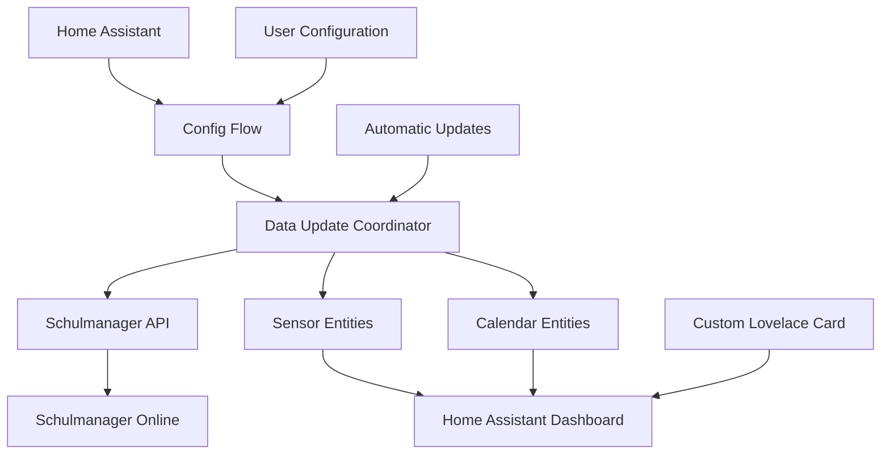

# Home Assistant Integration - Architecture

## 🏗️ Overview

The Schulmanager Online integration for Home Assistant follows official HA development guidelines and implements a complete custom integration with sensors, calendar integration, and custom UI components.

## 📁 Project Structure

```
custom_components/schulmanager_online/
├── __init__.py                 # Integration Entry Point
├── manifest.json              # HACS Integration Manifest
├── const.py                   # Constants and Configuration
├── config_flow.py             # UI-based Configuration
├── coordinator.py             # Data Update Coordinator
├── api.py                     # API Client
├── sensor.py                  # Sensor Entities
├── calendar.py                # Calendar Integration
├── strings.json               # UI Strings (English)
├── translations/              # Multi-Language Support
│   ├── de.json               # German Translation
│   ├── fr.json               # French Translation
│   └── ...                   # Additional Languages
└── www/                      # Custom Card Assets
    ├── schulmanager-schedule-card.js
    └── schulmanager-schedule-card-editor.js
```

## 🔄 Data Flow Architecture



## 🧩 Component Details

### 1. Integration Entry Point (`__init__.py`)

```python
async def async_setup_entry(hass: HomeAssistant, entry: ConfigEntry) -> bool:
    """Set up Schulmanager Online from a config entry."""
    
    # Extract configuration
    email = entry.data[CONF_EMAIL]
    password = entry.data[CONF_PASSWORD]
    
    # Create coordinator
    coordinator = SchulmanagerOnlineDataUpdateCoordinator(hass, email, password)
    
    # Fetch initial data
    await coordinator.async_config_entry_first_refresh()
    
    # Store coordinator
    hass.data.setdefault(DOMAIN, {})
    hass.data[DOMAIN][entry.entry_id] = coordinator
    
    # Setup platforms
    await hass.config_entries.async_forward_entry_setups(entry, PLATFORMS)
    
    return True
```

**Responsibilities:**
- Initialize integration
- Create and configure coordinator
- Load platforms (Sensor, Calendar)
- Error handling and cleanup

### 2. Data Update Coordinator (`coordinator.py`)

```python
class SchulmanagerOnlineDataUpdateCoordinator(DataUpdateCoordinator):
    """Class to manage fetching data from the API."""
    
    def __init__(self, hass: HomeAssistant, email: str, password: str):
        """Initialize."""
        super().__init__(
            hass,
            _LOGGER,
            name=DOMAIN,
            update_interval=timedelta(minutes=15),  # Update every 15 minutes
        )
        
        self.session = async_get_clientsession(hass)
        self.api = SchulmanagerAPI(email, password, self.session)
        self.students = []
    
    async def _async_update_data(self):
        """Update data via library."""
        try:
            # Get students if not cached
            if not self.students:
                self.students = await self.api.get_students()
            
            # Fetch schedule data for all students
            data = {}
            for student in self.students:
                student_id = student["id"]
                
                # Get current week and next week
                today = datetime.date.today()
                start_date = today - timedelta(days=today.weekday())  # Monday
                end_date = start_date + timedelta(days=13)  # 2 weeks
                
                schedule = await self.api.get_schedule(student_id, start_date, end_date)
                data[student_id] = {
                    "student": student,
                    "schedule": schedule,
                    "last_updated": datetime.now()
                }
            
            return data
            
        except Exception as exception:
            raise UpdateFailed(f"Error communicating with API: {exception}")
```

**Responsibilities:**
- Regular data updates (every 15 minutes)
- Coordinate API calls
- Provide data for all entities
- Error handling and retry logic

### 3. Configuration Flow (`config_flow.py`)

```python
class SchulmanagerOnlineConfigFlow(config_entries.ConfigFlow, domain=DOMAIN):
    """Handle a config flow for Schulmanager Online."""
    
    VERSION = 1
    
    async def async_step_user(self, user_input=None):
        """Handle the initial step."""
        if user_input is None:
            return self.async_show_form(
                step_id="user",
                data_schema=vol.Schema({
                    vol.Required(CONF_EMAIL): str,
                    vol.Required(CONF_PASSWORD): str,
                }),
                errors={}
            )
        
        errors = {}
        
        try:
            # Test the connection
            session = async_get_clientsession(self.hass)
            api = SchulmanagerAPI(user_input[CONF_EMAIL], user_input[CONF_PASSWORD], session)
            
            await api.authenticate()
            students = await api.get_students()
            
            if not students:
                errors["base"] = "no_students"
            else:
                # Create entry
                return self.async_create_entry(
                    title=f"Schulmanager ({user_input[CONF_EMAIL]})",
                    data=user_input,
                )
                
        except SchulmanagerAPIError as e:
            _LOGGER.error("Authentication failed: %s", e)
            errors["base"] = "invalid_auth"
        except Exception as e:
            _LOGGER.exception("Unexpected exception: %s", e)
            errors["base"] = "unknown"
        
        return self.async_show_form(
            step_id="user",
            data_schema=vol.Schema({
                vol.Required(CONF_EMAIL, default=user_input[CONF_EMAIL]): str,
                vol.Required(CONF_PASSWORD): str,
            }),
            errors=errors
        )
```

**Responsibilities:**
- UI-based configuration
- Credential validation
- User-friendly error messages
- Create integration entry

## 📊 Sensor Architecture

### Sensor Types

| Sensor | Description | Update Frequency |
|--------|-------------|------------------|
| **Current Lesson** | Current lesson | Every 5 minutes |
| **Next Lesson** | Next lesson | Every 5 minutes |
| **Today's Lessons** | All today's lessons | Every 15 minutes |
| **Today's Changes** | Today's substitutions | Every 15 minutes |
| **Next School Day** | Next school day | Every 15 minutes |
| **This Week** | This week | Hourly |
| **Next Week** | Next week | Hourly |
| **Changes Detected** | Changes detected | On changes |

### Sensor Implementation

```python
class SchulmanagerOnlineSensor(CoordinatorEntity, SensorEntity):
    """Representation of a Schulmanager Online sensor."""
    
    def __init__(
        self,
        coordinator: SchulmanagerOnlineDataUpdateCoordinator,
        student_id: int,
        sensor_type: str,
    ):
        """Initialize the sensor."""
        super().__init__(coordinator)
        
        self.student_id = student_id
        self.sensor_type = sensor_type
        self._attr_unique_id = f"{DOMAIN}_{student_id}_{sensor_type}"
        
        # Get student info
        student = self._get_student_info()
        student_name = f"{student['firstname']} {student['lastname']}"
        
        # Set entity properties
        self._attr_name = f"{student_name} {SENSOR_TYPES[sensor_type]['name']}"
        self._attr_icon = SENSOR_TYPES[sensor_type]['icon']
        self._attr_device_class = SENSOR_TYPES[sensor_type].get('device_class')
    
    @property
    def native_value(self):
        """Return the native value of the sensor."""
        if self.sensor_type == "current_lesson":
            return self._get_current_lesson()
        elif self.sensor_type == "next_lesson":
            return self._get_next_lesson()
        # ... additional sensor types
    
    @property
    def extra_state_attributes(self):
        """Return the state attributes."""
        attributes = {}
        
        if self.sensor_type == "current_lesson":
            lesson = self._get_current_lesson_details()
            if lesson:
                attributes.update({
                    "subject": lesson.get("subject"),
                    "teacher": lesson.get("teacher"),
                    "room": lesson.get("room"),
                    "start_time": lesson.get("start_time"),
                    "end_time": lesson.get("end_time"),
                })
        
        return attributes
```

## 📅 Calendar Integration

### Calendar Entity

```python
class SchulmanagerOnlineCalendar(CoordinatorEntity, CalendarEntity):
    """Representation of a Schulmanager Online calendar."""
    
    @property
    def event(self):
        """Return the next upcoming event."""
        events = self._get_upcoming_events()
        return events[0] if events else None
    
    async def async_get_events(self, hass, start_date, end_date):
        """Return calendar events within a datetime range."""
        events = []
        
        for student_id, data in self.coordinator.data.items():
            schedule = data["schedule"]
            student = data["student"]
            
            for lesson in schedule:
                lesson_date = datetime.strptime(lesson["date"], "%Y-%m-%d").date()
                
                if start_date <= lesson_date <= end_date:
                    event = CalendarEvent(
                        start=datetime.combine(lesson_date, 
                                             datetime.strptime(lesson["classHour"]["startTime"], "%H:%M").time()),
                        end=datetime.combine(lesson_date,
                                           datetime.strptime(lesson["classHour"]["endTime"], "%H:%M").time()),
                        summary=f"{lesson['lesson']['subject']} - {lesson['lesson']['teacher']}",
                        description=f"Room: {lesson['lesson']['room']}",
                    )
                    events.append(event)
        
        return events
```

## 🎨 Custom Card Integration

### Card Registration

```javascript
// schulmanager-schedule-card.js
class SchulmanagerScheduleCard extends LitElement {
    
    static get properties() {
        return {
            hass: {},
            config: {},
        };
    }
    
    setConfig(config) {
        if (!config.entity) {
            throw new Error('You need to define an entity');
        }
        this.config = config;
    }
    
    render() {
        const entity = this.hass.states[this.config.entity];
        
        if (!entity) {
            return html`<ha-card>Entity not found</ha-card>`;
        }
        
        return html`
            <ha-card>
                <div class="card-content">
                    ${this._renderSchedule(entity)}
                </div>
            </ha-card>
        `;
    }
}

customElements.define('schulmanager-schedule-card', SchulmanagerScheduleCard);
```

## 🔧 Configuration and Constants

### Constants (`const.py`)

```python
# Domain
DOMAIN = "schulmanager_online"

# Configuration
CONF_EMAIL = "email"
CONF_PASSWORD = "password"

# Platforms
PLATFORMS = ["sensor", "calendar"]

# Update intervals
UPDATE_INTERVAL = timedelta(minutes=15)
FAST_UPDATE_INTERVAL = timedelta(minutes=5)

# Sensor types
SENSOR_TYPES = {
    "current_lesson": {
        "name": "Current Lesson",
        "icon": "mdi:school",
        "device_class": None,
    },
    "next_lesson": {
        "name": "Next Lesson", 
        "icon": "mdi:clock-outline",
        "device_class": None,
    },
    # ... additional sensor types
}

# API URLs
SALT_URL = "https://login.schulmanager-online.de/api/salt"
LOGIN_URL = "https://login.schulmanager-online.de/api/login"
API_URL = "https://login.schulmanager-online.de/api/calls"
```

## 🌍 Internationalization

### String Management

```python
# strings.json (English - Base)
{
    "config": {
        "step": {
            "user": {
                "title": "Schulmanager Online",
                "description": "Enter your Schulmanager Online credentials",
                "data": {
                    "email": "Email or Username",
                    "password": "Password"
                }
            }
        },
        "error": {
            "invalid_auth": "Invalid authentication",
            "no_students": "No students found for this account",
            "unknown": "Unknown error occurred"
        }
    }
}
```

```python
# translations/de.json (German)
{
    "config": {
        "step": {
            "user": {
                "title": "Schulmanager Online",
                "description": "Geben Sie Ihre Schulmanager Online Zugangsdaten ein",
                "data": {
                    "email": "E-Mail oder Benutzername",
                    "password": "Passwort"
                }
            }
        },
        "error": {
            "invalid_auth": "Ungültige Anmeldedaten",
            "no_students": "Keine Schüler für dieses Konto gefunden",
            "unknown": "Unbekannter Fehler aufgetreten"
        }
    }
}
```

## 🔄 Lifecycle Management

### Setup Process

1. **Config Entry Creation**: User configures integration
2. **Coordinator Initialization**: Data Update Coordinator is created
3. **API Authentication**: Initial authentication with API
4. **Platform Setup**: Sensors and calendar are loaded
5. **Initial Data Fetch**: First data query
6. **Regular Updates**: Regular updates start

### Update Cycles

| Component | Interval | Trigger |
|-----------|----------|---------|
| **Coordinator** | 15 minutes | Timer |
| **Current/Next Lesson** | 5 minutes | Timer |
| **Schedule Changes** | On change | Data Comparison |
| **Token Refresh** | 55 minutes | Token Expiry |

### Cleanup Process

```python
async def async_unload_entry(hass: HomeAssistant, entry: ConfigEntry) -> bool:
    """Unload a config entry."""
    
    # Unload platforms
    unload_ok = await hass.config_entries.async_unload_platforms(entry, PLATFORMS)
    
    if unload_ok:
        # Remove coordinator
        coordinator = hass.data[DOMAIN].pop(entry.entry_id)
        
        # Close API session
        if hasattr(coordinator.api, 'session'):
            await coordinator.api.session.close()
    
    return unload_ok
```

## 📊 Performance Optimizations

### Caching Strategies

1. **Student Data**: One-time at login, then cached
2. **Schedule Data**: 15-minute cache with smart updates
3. **Token Management**: Automatic renewal with buffer
4. **API Rate Limiting**: Intelligent request batching

### Memory Management

- **Lazy Loading**: Load data only when needed
- **Data Pruning**: Automatically remove old data
- **Session Reuse**: Reuse HTTP session
- **Garbage Collection**: Explicit cleanup routines

## 🚨 Error Handling

### Error Recovery

```python
async def _async_update_data(self):
    """Update data with error handling."""
    try:
        return await self._fetch_data()
    except SchulmanagerAPIError as e:
        if "authentication" in str(e).lower():
            # Try to re-authenticate
            await self.api.authenticate()
            return await self._fetch_data()
        raise UpdateFailed(f"API Error: {e}")
    except Exception as e:
        _LOGGER.exception("Unexpected error during update")
        raise UpdateFailed(f"Unexpected error: {e}")
```

### Graceful Degradation

- **Partial Data**: Show available data during partial failures
- **Offline Mode**: Use last known data
- **User Feedback**: Clear error messages in UI
- **Automatic Recovery**: Automatic recovery after errors

## 📚 Further Documentation

- [API Implementation](API_Implementation.md) - API Client Details
- [Sensors Documentation](Sensors_Documentation.md) - Sensor Implementation
- [Custom Card Documentation](Custom_Card_Documentation.md) - UI Components
- [Configuration Guide](Configuration_Guide.md) - User Configuration
